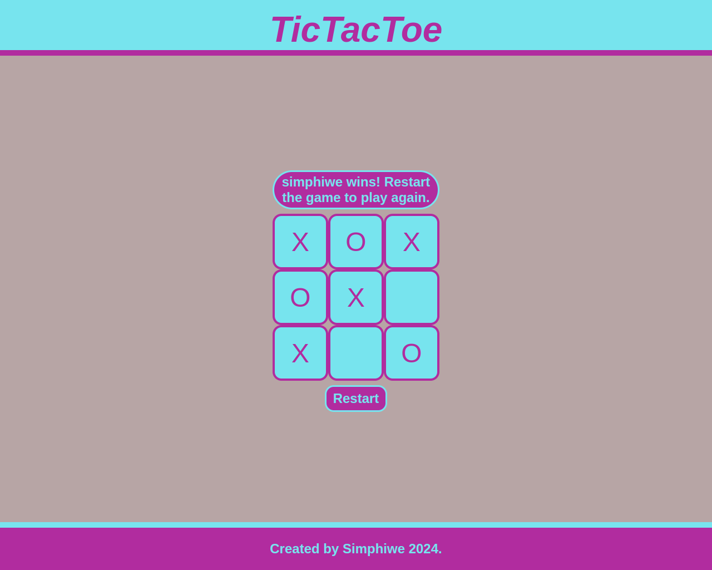

# **Tic Tac Toe**

Check it _**LIVE**_ 👉
**<https://deebest.github.io/tic-tac-toe/>**

A _**Tic-Tac-Toe**_ game is a 2 players board game where a first user to place 3 consecutive marks horizontally,diagonally or vertical wins the game, it is a project I built for the Odin project curriculum where I am learning the full stack web development.

## Features

- A user can play against another player.
- A user can also play against an AI player
- Each user has the ability to put his name so that the game can reference to the player with their name.

## Tech stack used

- GIT
- HTML
- CSS
- JavaScript

## Contact

Get in touch:

Email : **<simphiwedladla8@gmail.com>**

Linked: **<https://www.linkedin.com/in/dladla-simphiwe-89061a20a/>**

Github: **<https://github.com/DeeBest>**
